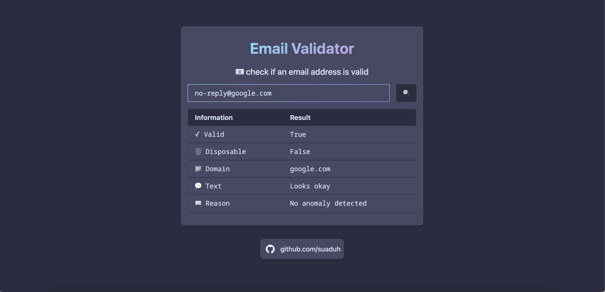

# Email Validator App

This is a simple web application built with React, Node.js, and Tailwind CSS to check the validity of an email address.

This application utilizes the [E-mail Check Invalid or Disposable Domain API](https://rapidapi.com/Top-Rated/api/e-mail-check-invalid-or-disposable-domain) to validate email addresses. You can access the live preview of this application [here](https://email-validator-8d287f3569ad.herokuapp.com/). 

## Features

- Checks if an email address exists or not.
- Provides information about the email address:
  - Validity
  - Disposable status
  - Domain
  - Text
  - Reason (if invalid)
## Acknowledgements

Built upon the work of [DevRel-Examples-External](https://github.com/RapidAPI/DevRel-Examples-External/tree/main/email-validator-app)
